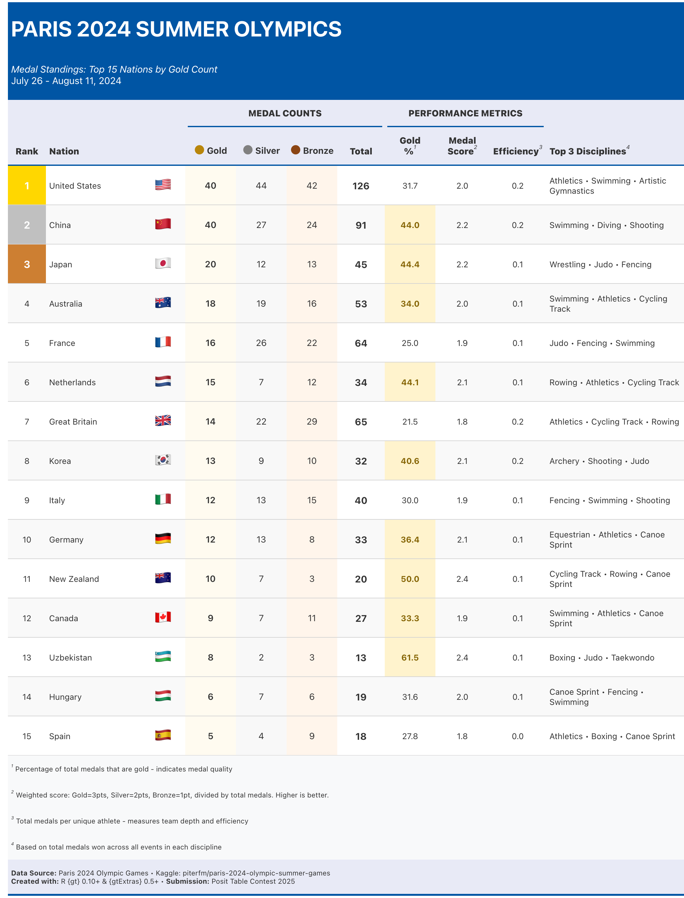

# Paris 2024 Olympics: Medal Performance Analysis

A data visualization project analyzing the top 15 medal-winning nations at the Paris 2024 Summer Olympics. Created for the **Posit Table Contest 2025** using R's `{gt}` package.



## 📊 Project Overview

This table presents a comprehensive analysis of Olympic performance, combining:
- Official medal counts (gold, silver, bronze)
- Performance efficiency metrics
- Weighted scoring system
- Top disciplines per nation
- Visual hierarchy with podium-style ranking

## 🎯 Key Features

### Medal Counts
Individual columns for gold, silver, and bronze medals with color-coded backgrounds matching Olympic medal colors.

### Performance Metrics
- **Gold %**: Percentage of total medals that are gold (indicates medal quality)
- **Medal Score**: Weighted average where Gold=3pts, Silver=2pts, Bronze=1pt, divided by total medals
- **Efficiency**: Total medals per unique athlete (measures team depth and performance per capita)

### Visual Design
- Top 3 nations highlighted with gold, silver, and bronze rank backgrounds
- Country flags displayed using Unicode emoji (universal compatibility)
- Olympic blue color scheme (#0055A4)
- Clean, readable typography with proper spacing

## 📁 Repository Contents

```
├── paris_2024_olympics.R                      # Main R script
├── medals.csv                                 # Medal data (1,044 rows)
├── athletes.csv                               # Athlete data
├── paris_2024_olympics_medal_table.png        # PNG output (1600x900px)
├── paris_2024_olympics_medal_table.html       # HTML output
└── README.md                                  # This file
```

## 📦 Requirements

```r
# Required R version
R >= 4.0.0

# Required packages
install.packages(c(
  "gt",        # >= 0.10.0
  "gtExtras",  # >= 0.5.0
  "tidyverse"  # >= 2.0.0
))
```

## 🚀 How to Run

1. **Clone this repository:**
```bash
git clone https://github.com/ramadatta/paris-2024-olympics-table.git
cd paris-2024-olympics-table
```

2. **Ensure data files are present:**
   - `medals.csv`
   - `athletes.csv`

3. **Run the R script:**
```r
source("paris_2024_olympics.R")
```

4. **Outputs will be generated:**
   - `paris_2024_olympics_medal_table.html` (interactive)
   - `paris_2024_olympics_medal_table.png` (static image)

## 📈 Data Source

**Dataset**: [Paris 2024 Olympic Summer Games](https://www.kaggle.com/datasets/piterfm/paris-2024-olympic-summer-games)  
**Author**: piterfm on Kaggle  
**License**: CC BY 4.0

### Data Processing Steps

1. **Medal aggregation**: Grouped by country and medal type
2. **Athlete counts**: Unique athlete codes per country from athletes.csv
3. **Efficiency calculation**: Total medals ÷ unique athletes
4. **Score calculation**: (Gold×3 + Silver×2 + Bronze×1) ÷ Total medals
5. **Ranking**: Sorted by gold count, then silver, then bronze (official IOC method)

## 🎨 Design Decisions

### Why These Metrics?
- **Gold %**: Shows medal quality - countries with higher percentages excel in their strongest events
- **Medal Score**: Weighted system reflects that gold medals are more prestigious
- **Efficiency**: Normalizes for team size - shows which nations get most from their athletes

### Why This Layout?
- **Podium colors**: Makes top 3 instantly recognizable
- **No redundant visualizations**: Each element serves a purpose
- **Clear hierarchy**: Medal counts → Performance metrics → Context (disciplines)

### Why These Colors?
- Olympic blue (#0055A4) from official Olympic branding
- Actual medal colors for data columns (#FFD700, #C0C0C0, #CD7F32)
- Subtle backgrounds to avoid overwhelming the data

## 📝 Code Highlights

### Universal Flag Converter
Converts any ISO country code to emoji flag automatically:
```r
code_to_flag <- function(code) {
  chars <- strsplit(toupper(code), "")[[1]]
  flag_chars <- sapply(chars, function(c) {
    intToUtf8(127462 + (utf8ToInt(c) - utf8ToInt("A")))
  })
  paste0(flag_chars, collapse = "")
}
```

### Dynamic Ranking
Uses official Olympic ranking method (gold count primary, silver secondary, bronze tertiary):
```r
arrange(desc(gold), desc(silver), desc(bronze))
```

## 🏆 Contest Submission

**Competition**: Posit Table Contest 2025  
**Category**: Sports Analytics  
**Submission Date**: [Your submission date]  

### Why This Table Works
1. **Utility**: Provides actionable insights (efficiency, quality metrics)
2. **Beauty**: Clean design with Olympic theming
3. **Technical Excellence**: Reproducible, well-documented, uses real data
4. **Clarity**: Every metric explained in footnotes for novice readers

## 📄 License

Code: MIT License  
Data: CC BY 4.0 (Kaggle dataset license)

## 👤 Author

[Sai Rama Sridatta Prakki]  
[[GitHub Profile](https://github.com/ramadatta)]  

Created for Posit Table Contest 2025


**Note**: This project uses only the Paris 2024 dataset. No historical comparisons or external data sources were included to maintain reproducibility and data quality.
